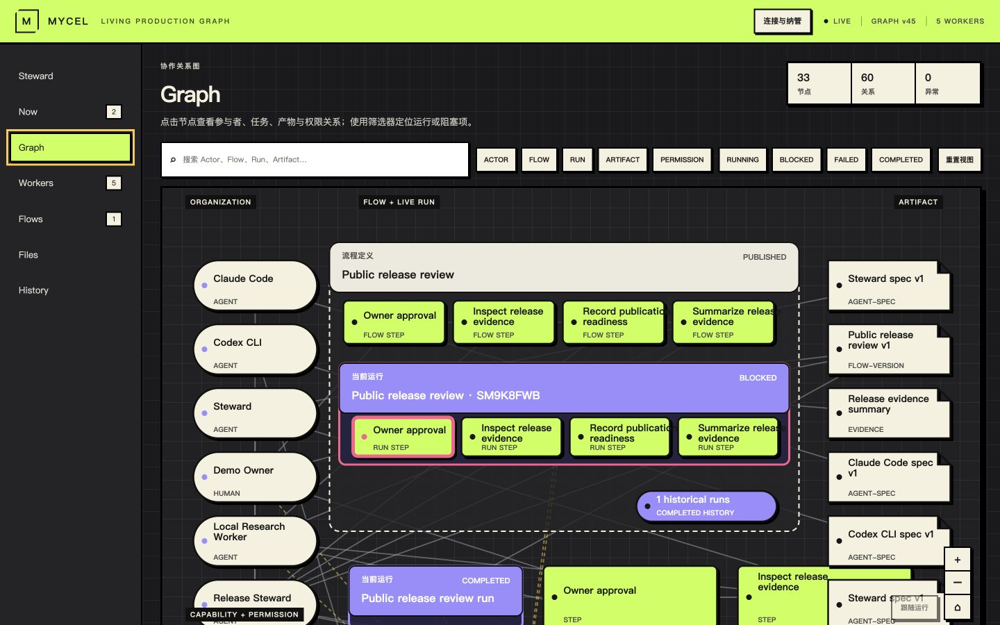
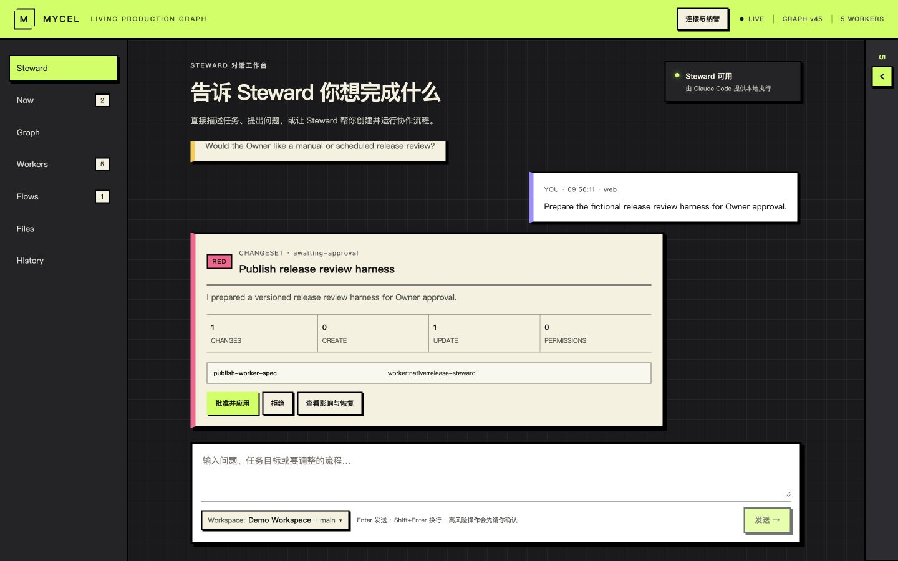
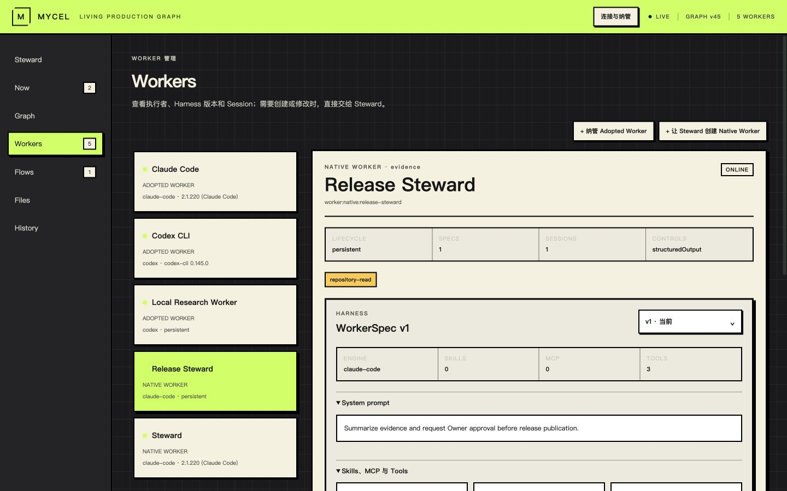
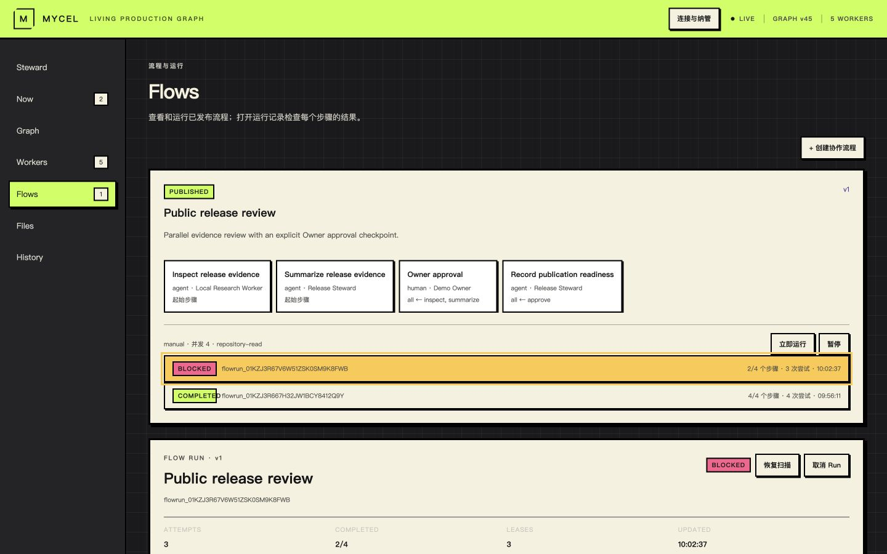

# Mycel

<p align="center">
  <strong>面向人与 Agent 长期协作的 Local-first 持续生产图。</strong>
</p>

<p align="center">
  <a href="./README.md">English</a> · 简体中文
</p>

<p align="center">
  <a href="./LICENSE"></a>
  
  
</p>

Mycel 是一个在本地运行的生产协作工作台，帮助人与 AI Agent 建立可长期运转的协作关系。Steward 将人的意图转化为有序工作，Living Graph 则把参与者、Worker、Flow、Run、证据、权限与产物连接在同一套生产模型中。

对话承担自然的意图入口；类型化 Graph 与本地账本持续沉淀关键决策和工作结果，让每一项长期事实都有清晰、可查看的位置。

## 看见 Mycel 如何工作

<p align="center">
  <a href="./docs/assets/screenshots/graph.png">
    
  </a>
  <br>
  <sub><strong>Living Graph</strong> — 从一张相互连接的图中理解整个生产系统。</sub>
</p>

<table>
  <tr>
    <td width="50%" valign="top">
      <a href="./docs/assets/screenshots/steward.png">
        
      </a>
      <br>
      <sub><strong>Steward</strong> — 表达目标、审阅变更，并始终掌握工作方向。</sub>
    </td>
    <td width="50%" valign="top">
      <a href="./docs/assets/screenshots/workers.png">
        
      </a>
      <br>
      <sub><strong>Workers</strong> — 纳管已有 Agent，也可以塑造面向特定工作的原生 Worker。</sub>
    </td>
  </tr>
</table>

<p align="center">
  <a href="./docs/assets/screenshots/flow-run.png">
    
  </a>
  <br>
  <sub><strong>Flows & Runs</strong> — 将有效协作方式沉淀为可重复运行的生产系统。</sub>
</p>

## 产品设计理念

### 让协作持续积累上下文

有价值的工作往往会跨越多次对话与执行。Mycel 将责任、协作关系、可复用 Flow、工作结果和证据长期连接起来，让每一次新运行都能从有效上下文继续前进。

### 让意图表达保持简单

Steward 让自然语言对话成为系统入口，帮助用户描述目标、澄清模糊需求并形成可持续的变更。用户无需直接操作复杂的 Graph，也能参与生产系统的建设。

### 让所有参与者共享同一幅生产全景

Living Graph 连接人与 Worker、Work、Flow、Run、权限、证据和产物。团队可以在统一视图中理解已有资源、协作关系、运行状态，以及当前需要关注的位置。

### 让人的责任始终清晰

Human Actor 在生产模型中拥有明确位置。归属、批准、验收与介入都会成为工作的一部分，让 Agent 在清晰的责任和授权下发挥能力。

### 让有效生产方式可以复用

一次成功协作可以沉淀为 Flow，经过版本化后持续运行，并根据积累的证据不断改进。团队由此将个体经验转化为长期生产能力，同时保留参与者和上下文之间的连接。

## Mycel 的核心体验

1. **塑造生产系统** — 告诉 Steward 你希望完成什么，引入参与协作的人与 Worker，并描述他们的协作方式。
2. **共同完成工作** — 启动任务或可复用 Flow，跟随实时进度，在需要人工判断时及时介入。
3. **理解并持续演进** — 查看结果、证据、产物和历史，再为下一次运行优化协作关系或 Flow。

## Mycel 连接的核心能力

- **Steward** 通过对话承接意图、澄清需求、提出变更并协调日常工作。
- **Living Graph** 为生产系统提供跨会话持续存在、相互连接且便于查看的结构。
- **Workers** 将本地已有 Agent 与面向特定工作的原生 Agent 纳入统一模型，并保留版本化工作上下文。
- **Flows & Runs** 让人与 Agent 的协作可以重复运行、持续观察，并通过证据和产物呈现结果。

## 在本地运行 Mycel

运行前需要准备 Node.js 22.5 或更高版本、Git，以及已登录的 Claude Code CLI。你也可以将 Codex CLI 作为可选 Worker 加入 Mycel。

```bash
npm ci
cp .env.example .env.local
npm run demo:public-reset
npm run doctor
npm run dev
```

打开终端中显示的本地 Web 地址。重置命令会使用虚构数据准备一个全新的本地演示工作区，便于你直接体验完整产品流程。

## 了解更多

- 阅读[架构说明](./docs/ARCHITECTURE.md)，了解系统模型、模块边界、事件流转与恢复设计。
- 阅读[贡献指南](./CONTRIBUTING.md)，通过公开仓库提交改进建议。
- 使用 Agent 编程工具参与贡献时，请先阅读 [AGENTS.md](./AGENTS.md)。

## 许可证

Mycel 使用 [Apache License 2.0](./LICENSE)。
