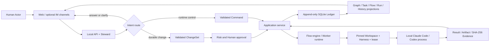

# Mycel Architecture

Mycel is a local-first living production graph: durable collaboration relationships are represented as typed, versioned facts rather than inferred later from a chat transcript. Conversation is the control surface. The Graph, append-only SQLite Ledger, Runs, Evidence, Permissions, and Artifacts are the fact surface.

This document describes the implemented V1 boundaries. It does not claim production multi-tenancy, remote Worker execution, or automatic Git delivery.

## Domain vocabulary

- A **Human Actor** is a person responsible for ownership, approval, permission, judgment, or acceptance.
- A **Worker** executes bounded work. An **Adopted Worker** wraps a local Claude Code/Codex CLI or a registered external endpoint. A **Native Worker** is created in Mycel and governed by an immutable `WorkerSpecVersion`.
- **Steward** is the conversation coordinator. It routes an intent to an answer, clarification, durable `ChangeSet`, or runtime `Command`.
- A **Workspace** is a server-resolved Repository, directory, or isolated Git worktree.
- A **Worker Harness** is the rendered system prompt, tools, skills, MCP declarations, files, lifecycle, budget, and delegation limits pinned for a Worker Session.
- **Work** is a durable graph fact. A **Task** is an assignable, acceptable unit of work; an **Attempt** is one try; a **Worker Session** is that Attempt's controlled provider-adapter execution.
- A **Flow** is a repeatable Human + Worker DAG. A **FlowVersion** is one immutable published definition. A **Run** pins one FlowVersion and creates Step, Attempt, Result, Lease, Artifact, and Human Task facts; a Human Task is a Step that waits for a person to claim and submit a result.
- A **permission lease** is the minimal time-limited authority granted to an Attempt.

## Package boundaries

| Area | Responsibility | Must not become |
| --- | --- | --- |
| `apps/web` | React workbench, Steward conversation, graph/run/worker/file/history projections | A source of truth or a holder of credentials |
| `apps/server` | Local HTTP API, SSE, runtime composition, validation, connection provisioning, host integration | A route layer that trusts browser paths or raw shell strings |
| `packages/domain` | Schemas, IDs, graph operations, shared types, invariants | Provider-specific process code |
| `packages/application` | Event-sourced application service, commands, ChangeSets, projections, control-plane state | Direct UI or channel rendering |
| `packages/steward-claude` | Steward intent contract and Claude Code planning adapter | Durable storage or independent authorization |
| `packages/agent-runtime` | Normalized Claude Code/Codex Worker probing, sessions, controls, and events | A policy bypass around Workspace or Harness constraints |
| `packages/executor-claude-code` | Safe argv process execution and isolated Git worktree execution | A general-purpose shell interpolation layer |
| `packages/flow-engine` | FlowVersion/Run scheduling, joins, retries, Human Tasks, leases, checkpoints | The system of record |
| `packages/workspace-files` | Registered Workspace paths, safe file traversal/preview, Git metadata, artifacts | Trust in client-supplied filesystem paths |
| `packages/ledger-sqlite` | Append-only event persistence and durable reload | Business policy hidden in storage code |
| `packages/channel-dingtalk`, `packages/channel-feishu` | Optional transport normalization and responses | A source of truth or credential exposure surface |

The package name `agent-runtime` remains for compatibility while the product vocabulary uses Worker.

## Data flow



1. Web or an optional channel normalizes user input at the local server boundary.
2. Steward uses a read-oriented planning contract to return an answer, request clarification, propose a ChangeSet, or issue a Command against an existing object.
3. Domain schemas, current versions, preconditions, dependencies, and risk policy validate durable operations. High-risk ownership, permission, acceptance, or overwrite decisions wait for a Human Actor.
4. The application service appends accepted facts to the Ledger. Projections derive current Graph, Tasks, Worker Sessions, Flows, Runs, Evidence, and History from those events.
5. A Task/Run starts with a captured Workspace, WorkerSpecVersion-rendered Harness, budget, and permission lease. The runtime invokes only the selected adapter.
6. Normalized progress is visible to users. Results and hashes return through the application service and become durable evidence/artifact relationships.

## Event sourcing and consistency

The SQLite Ledger is append-only at the application boundary. Each event has an aggregate, type, causal/correlation metadata, and payload. Reducers project current state; the Ledger remains the audit and replay source. A browser card, IM message, or process stream is never the authoritative state.

ChangeSets carry operations, preconditions, and dependency ordering. Validation occurs before application, and partial outcomes are represented explicitly rather than relabeled as success. Commands target already-existing control-plane objects and use version/precondition checks where the contract requires them.

The design favors observable at-least-once recovery with idempotent checkpoints: completed steps and side effects are persisted before dependent work advances. V1 does not claim a distributed exactly-once guarantee across external providers.

## Worker Harness and session pinning

A `WorkerSpecVersion` is immutable after publication. When a Worker Session starts, Mycel renders and pins the effective Harness together with:

- Worker and adapter identity;
- Workspace and execution mode;
- allowed tools, skills, files, and MCP declarations;
- model/effort selection and budget ceilings;
- delegation depth and fan-out limits;
- permission lease and its expiry;
- provider session reference when one exists.

Changing a Worker or Flow later creates a new version; it does not mutate the contract of an active Session or Run. Secret values are resolved from local `SecretRef` storage only for the process boundary. They are not embedded in WorkerSpec, Graph, Ledger, or browser projections. Short-lived materialized MCP configuration is owner-only and cleaned up after the Session.

## Flow runtime and recovery

A published FlowVersion contains Worker and Human steps, dependency edges, join policy (`all`, `any`, `quorum`, or `race`), retry policy, concurrency/capacity limits, permission ceiling, and budgets. A Run pins that version. Each attempt receives its own lease and structured input assembled from the goal, upstream results, file references, and Harness.

Human steps become durable Human Tasks and pause downstream scheduling. Worker results, changed files, and evidence references become typed Run-subgraph facts. On restart, runtime composition reloads the Ledger and durable Flow state, reconstructs projections, and resumes from checkpoints. It does not intentionally replay already-completed side effects. Interrupted or expired work is surfaced for recovery rather than silently marked complete.

SQLite provides local durability, not cross-host consensus. Provider calls can still fail or become ambiguous at their external boundary; recovery UI and idempotency coverage remain active V1/V2 work.

## Trust boundaries

### Browser and local server

The browser is an untrusted presentation/client boundary. It sends object IDs and user intent, not trusted filesystem authority. Server APIs resolve registered Workspace paths with realpath checks and reject traversal outside the Workspace. Browser responses expose secret configuration status or masked hints, never credential values.

### Local filesystem and process execution

Mycel's local process has the operating-system rights of the user who starts it. It must narrow those rights through Workspace selection, execution mode, tool policy, and permission leases. Commands use an executable plus argv with `shell: false`; user input is never interpolated into a shell command string. Git execution work uses isolated branches/worktrees where the execution contract requires them.

### Credentials

`.env.local` and `.local` are outside the source boundary. Connection and Worker secrets are written to owner-only files under the configured data directory. Secret values must not enter events, Graph nodes, browser payloads, progress, fixtures, logs, or screenshots.

### Git remotes

A configured remote URL is descriptive configuration, not authorization to clone, fetch, pull, push, merge, overwrite, force-update, or delete. Each network or destructive action needs its own explicit interaction and policy decision. V1 acceptance does not merge or push an execution branch.

### Provider and protocol adapters

Claude Code and Codex are separately installed and authenticated local CLIs. Provider availability, billing, session behavior, and data policy remain external boundaries. MCP/A2A endpoints can be registered, handshaken, inspected, and represented in the Graph, but protocol-specific remote execution and credential provisioning are not implemented by registration alone.

### Channel adapters

DingTalk and Feishu convert messages and interactions into the same local application contracts used by Web. They do not own Graph, approval, Run, or recovery state. Credentials remain in local secret storage. Channel failure can delay interaction but must not replace Ledger facts. V1 does not implement multi-participant IM group-thread orchestration.

## Local storage layout

With the default `MYCEL_DATA_DIR=.local/mycel`, runtime data includes:

```text
.local/mycel/
├── ledger.sqlite
├── worktrees/
├── sessions/
└── secrets/
    ├── connections.json
    └── worker-secrets.json
```

Exact subdirectories are created as needed. The entire `.local` tree and `.env.local` are runtime data, not source artifacts, and must never be committed.

## V1 limitations

- This is a local demo/reference architecture, not a production-hardened, multi-tenant, highly available service.
- Remote MCP/A2A protocol execution remains adapter work after registration and capability discovery.
- Real Claude CLI execution can depend on provider and authenticated-session reliability; the current smoke boundary is not considered consistently passing.
- Advanced session controls and restart/idempotency journeys are not yet consistent across every adapter and UI surface.
- IM group-thread orchestration is not implemented.
- Acceptance records evidence approval but does not automatically merge or push a branch.
